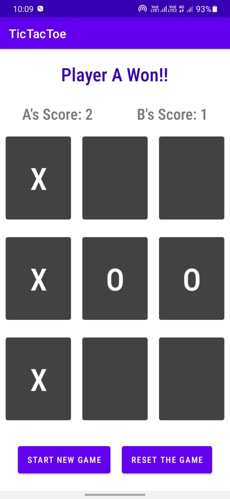
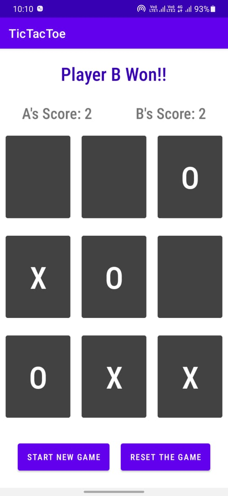
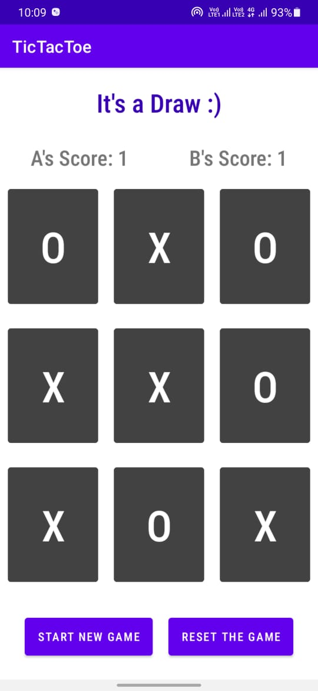

# TicTacToe Game

## This is the World Famous Game, "TicTacToe" that has been fully developed in Kotlin Programming Language.
## It has the following features: 2 Player Play, Win Counter for both the players, Draw Detector and Win Detector.

## Screenshots -

